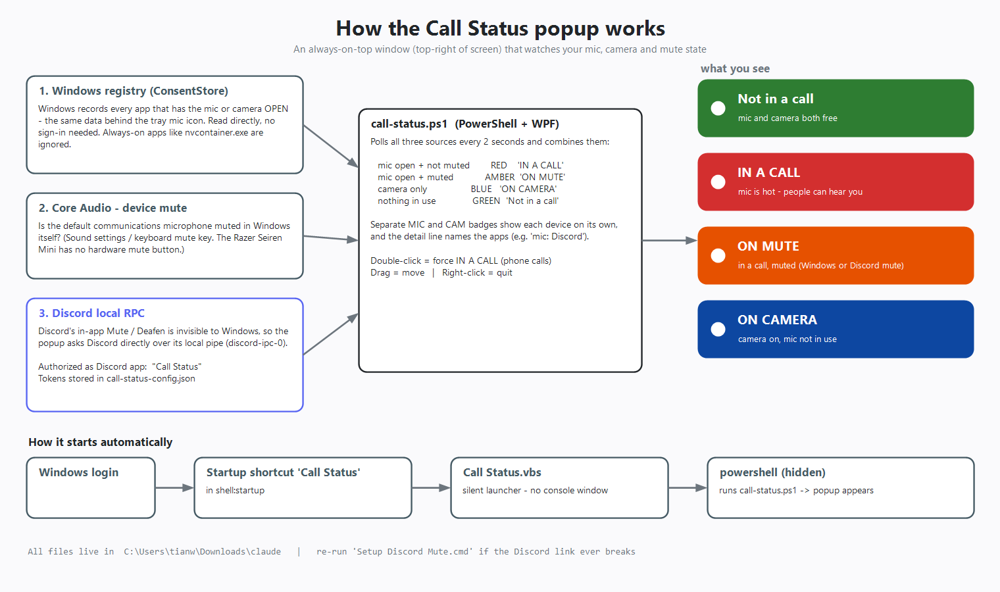

# Call Status

An always-on-top badge that says whether your microphone or camera is live, so the people around
you can tell at a glance whether you are in a call.

## States

| Colour | Meaning |
| --- | --- |
| Green - `FREE` | Nothing is using the mic or camera |
| Red - `IN A CALL` | The mic is open and unmuted |
| Amber - `ON MUTE` | Something holds the mic, but you are muted |
| Blue - `ON CAMERA` | Camera only, no mic |
| Yellow - `GAME MIC` | A game is the only thing on the mic |

Separate MIC and CAM badges spell out each device, and a detail line names the apps involved.

## How it detects things

- **Mic / camera in use** - the `CapabilityAccessManager\ConsentStore` registry keys Windows
  itself uses to drive the privacy indicators. Apps that hold the mic permanently (NVIDIA's
  `nvcontainer.exe`, for instance) sit on an ignore list.
- **Device-level mute** - Core Audio, so a mute from Sound settings or a headset button counts.
- **Discord in-app mute / deafen** - Discord's local RPC socket. This part is optional and needs
  the one-time setup below.

## Install

1. Drop this folder anywhere.
2. Press `Win+R`, run `shell:startup`, and put a shortcut to **`Call Status.vbs`** in there. The
   `.vbs` launcher exists purely to start PowerShell without a console window flashing up.

## Controls

- **Drag** the badge to move it. Position and size are remembered across restarts.
- **Drag any edge or corner** to resize. The badge scales to fill whatever shape you give it.
- **Hover** for a tooltip listing the controls.
- **Double-click** to force `IN A CALL` on or off manually.
- **Right-click** to quit.

## Optional: Discord mute detection

Without this the badge still works; it just cannot tell that you muted yourself *inside* Discord
rather than at the device level.

1. Create an application at <https://discord.com/developers/applications>.
2. Add `http://localhost:7654/callback` as an OAuth2 redirect URI.
3. Copy `call-status-config.example.json` to `call-status-config.json` and fill in the client ID
   and secret.
4. Run **`Setup Discord Mute.cmd`** and approve the browser prompt. It writes the tokens back
   into `call-status-config.json`.

`call-status-config.json` holds a client secret and OAuth tokens, so it is gitignored. Keep it
that way. Re-run the setup if the tokens ever stop working.

## Requirements

Windows PowerShell 5.1 and .NET Framework - both ship with Windows. Nothing to install.
